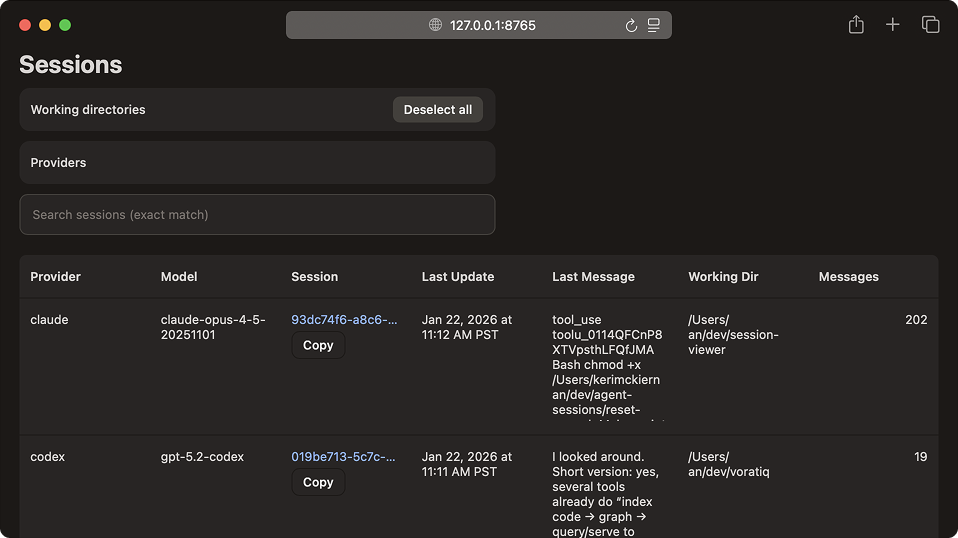

# Agent Sessions

[](https://github.com/kmckiern/session-viewer/actions/workflows/ci.yml)

Browse and search Claude Code, Codex CLI, and Gemini CLI session history in a unified local web UI.



## Features

- Unified timeline for Claude Code, Codex, and Gemini CLI sessions
- Search and filter by provider or working directory
- Dark mode, no runtime dependencies

## Supported Providers

| Provider     | ID             | Default Paths |
| ------------ | -------------- | ------------- |
| Claude Code  | `claude-code`  | `~/.claude/projects`, `~/.claude/__store.db` |
| OpenAI Codex | `openai-codex` | `~/.codex/sessions` |
| Gemini CLI   | `gemini-cli`   | `~/.gemini`, `~/.config/google-generative-ai`, platform-specific paths* |

\* Gemini also checks `~/.local/share/google-generative-ai` (Linux), `~/Library/Application Support/google/generative-ai` (macOS), and `%APPDATA%/google/generative-ai` (Windows).

## Configuration

Override base directories with environment variables:

- `CODEX_HOME`
- `CLAUDE_HOME`
- `GEMINI_HOME`

Cache controls:

- `AGENT_SESSIONS_CACHE_DIR` (default: `~/.cache/agent-sessions` on Linux, `~/Library/Caches/agent-sessions` on macOS)
- `AGENT_SESSIONS_DISABLE_DISK_CACHE=1` to disable disk caching
- `AGENT_SESSIONS_REFRESH_INTERVAL` to change the auto-refresh interval in seconds (default: `30`)

Debug logging:

- `AGENT_SESSIONS_DEBUG=1` to emit provider warnings and parsing diagnostics

## Installation

With `uv`:

```bash
uv venv && source .venv/bin/activate && uv pip install -e ".[dev]"
```

With `pip`:

```bash
python -m venv .venv && source .venv/bin/activate && pip install -e ".[dev]"
```

## Usage

```bash
agent-sessions
```

Opens `http://127.0.0.1:8765`. Initial load may take a moment while sessions are indexed.

| Flag         | Description                         |
| ------------ | ----------------------------------- |
| `--host`     | Bind address (default: `127.0.0.1`) |
| `--port`     | Port (default: `8765`)              |
| `--no-cache` | Reload sessions on every request    |

## Privacy

This is a local-only viewer. No telemetry, no authentication, no data leaves your machine.

Session archives may contain sensitive data. Before sharing screenshots or logs, remove usernames, paths, secrets, and transcripts.

## Troubleshooting

- **Empty results**: Verify the default paths above or set `CODEX_HOME`, `CLAUDE_HOME`, or `GEMINI_HOME` to the directory that contains your session data.
- **Permissions errors**: Ensure the running user can read the session directories. On macOS, check Full Disk Access if the folders are restricted.
- **Cache behavior**: Delete the cache directory or set `AGENT_SESSIONS_DISABLE_DISK_CACHE=1` if results look stale.

## Support / Questions

Open a GitHub issue or discussion for help. For security concerns, see `SECURITY.md`.

## Contributing

See `CONTRIBUTING.md` for setup, linting, and test guidance.

## License

[MIT](LICENSE)
